# 基于Java+SpringBoot+Vue充电桩管理系统(源码+数据库)

#### 作者QQ：3275035005 微信：xkbishe123 (支持修改、 部署调试、 代做接毕业设计和课程设计)

#### 网站建设、小程序、H5、APP、各种系统、样式修改、10000套源码可选。

#### 选题+开题报告+任务书+程序定制+安装调试+论文+答辩ppt 都可以做

#### 问题包修改，包满意，有需求尽管甩过来！一条龙帮你安心过！

#### 所有项目以及源代码本人均调试运行无问题 可支持远程调试运行

# 项目介绍
基于Java+SpringBoot+Vue充电桩管理系统-毕业设计，本系统前台和后台管理两部分，项目采用前后端分离

可选题目：充电站管理系统、智慧充电桩系统平台

### 1. 用户

用户登录、用户注册、找回密码、首页轮播图、首页充电站、充电站搜索、充电桩立即充电、查看我的订单、修改个人资料、余额充值、查看反馈列表、提交反馈、退出登录

### 2. 管理员

管理员登录、找回密码、充电站信息：分页查询、新增、修改、删除、充电桩信息：分页查询、新增、修改、删除、订单信息：分页查询、删除、用户信息管理：分页查询、新增、修改、删除、系统公告管理：分页查询、修改、用户反馈管理：分页查询、处理反馈、删除、轮播图管理：分页查询、处理反馈、删除、个人中心：修改、退出登录

# 技术框架

- 开发语言：Java
- 数据库：Mysql5.7以上
- 系统环境：jdk8、maven、node
- 后端框架：SpringBoot、MyBatis
- 前端框架：Vue、ElementUI
- 工具：IDEA、Navicat
- 技术架构：前后端分离、B/S架构、MVC架构
# 项目截图

### 1. 管理端

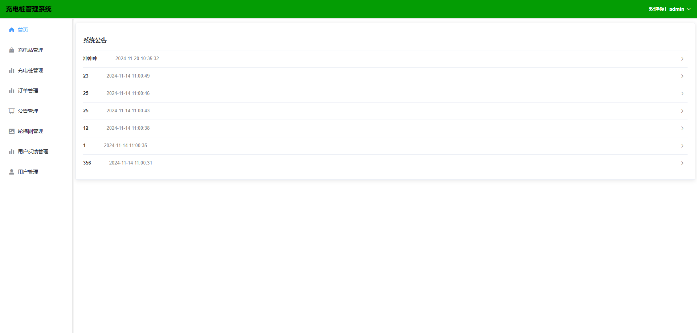

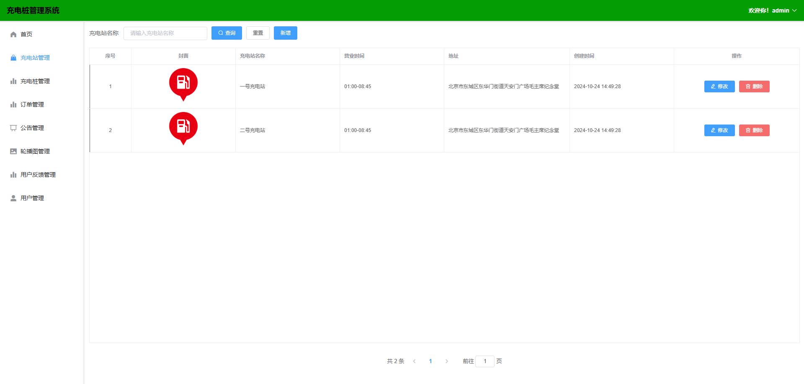

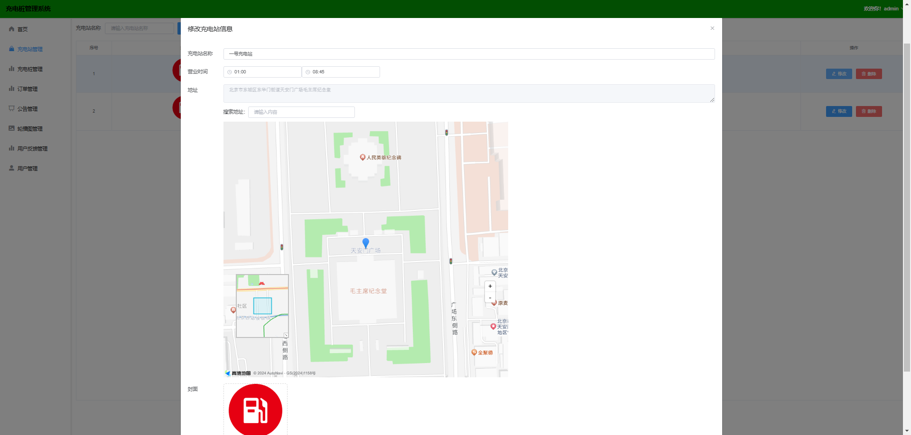

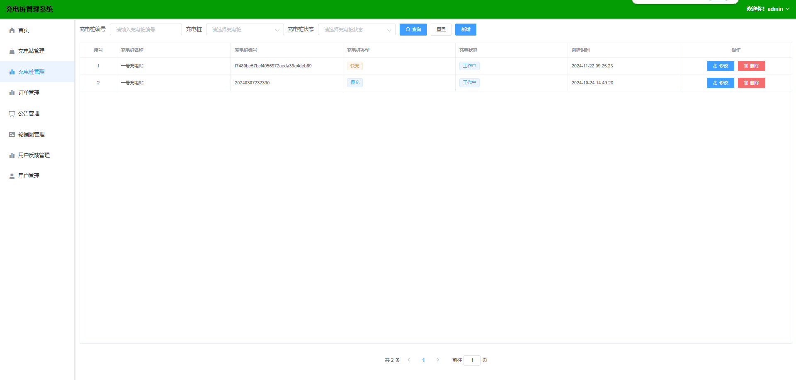

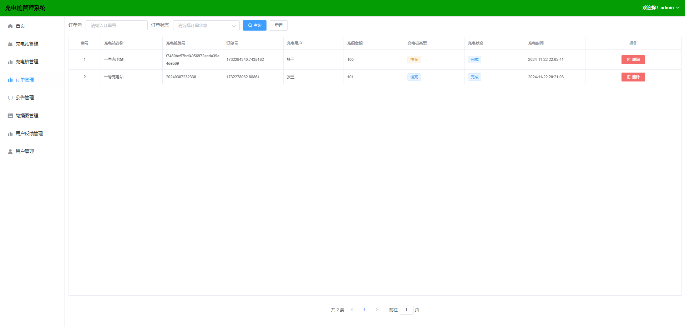

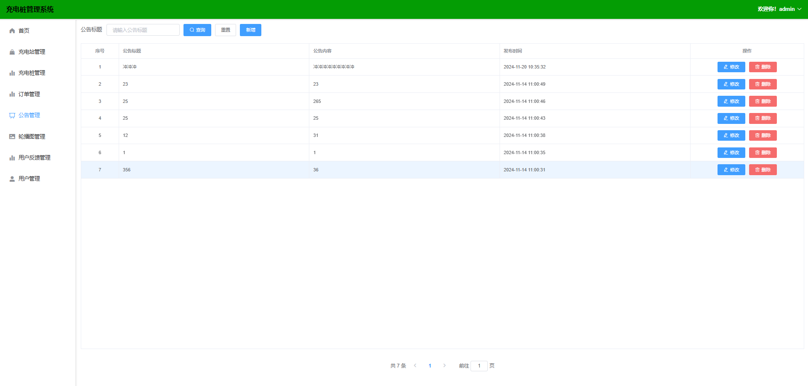

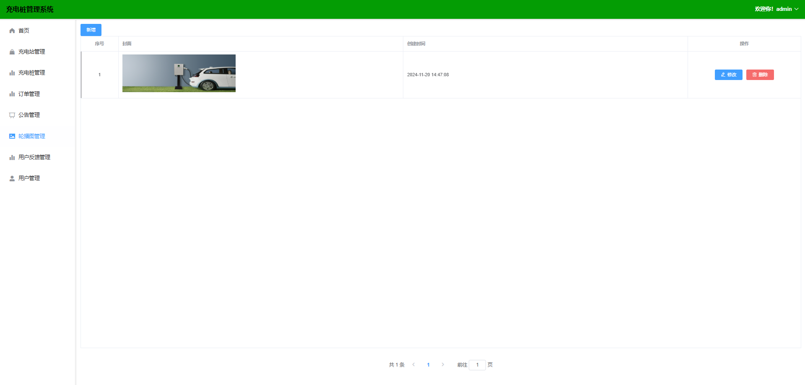

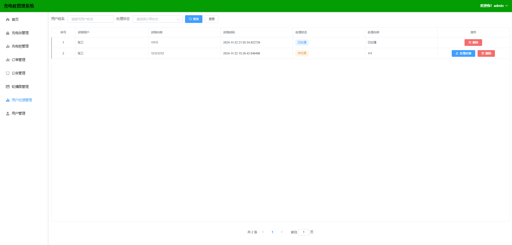

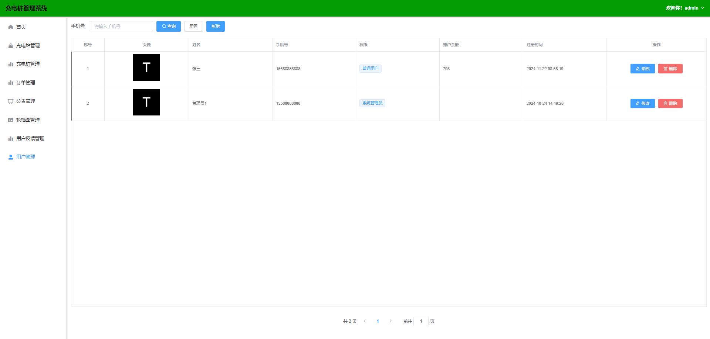

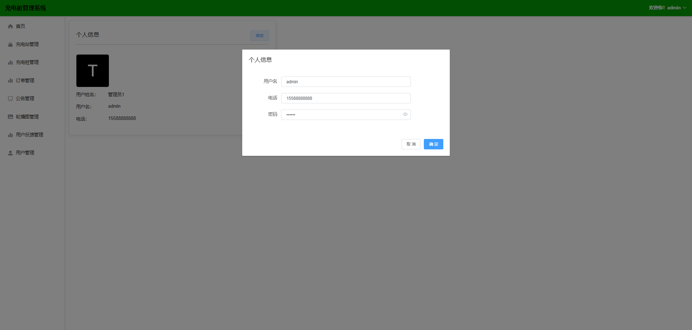

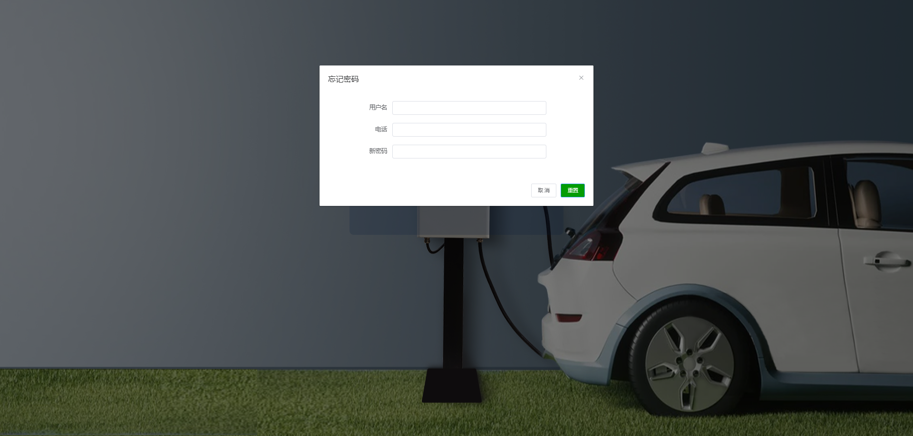

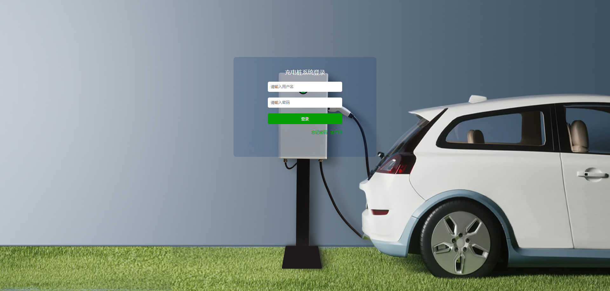

### 2. 用户端

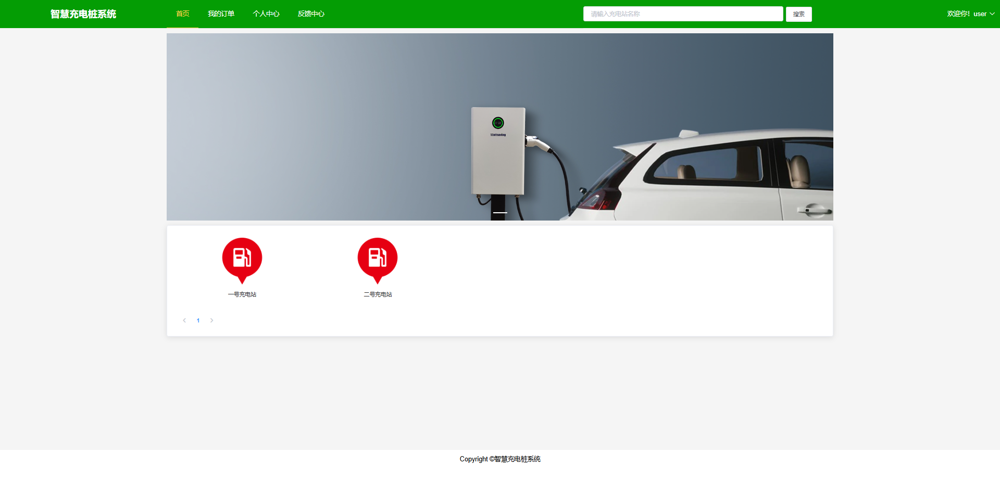

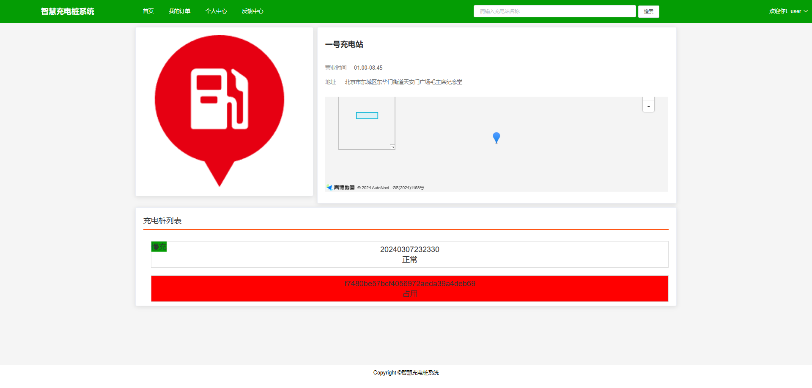

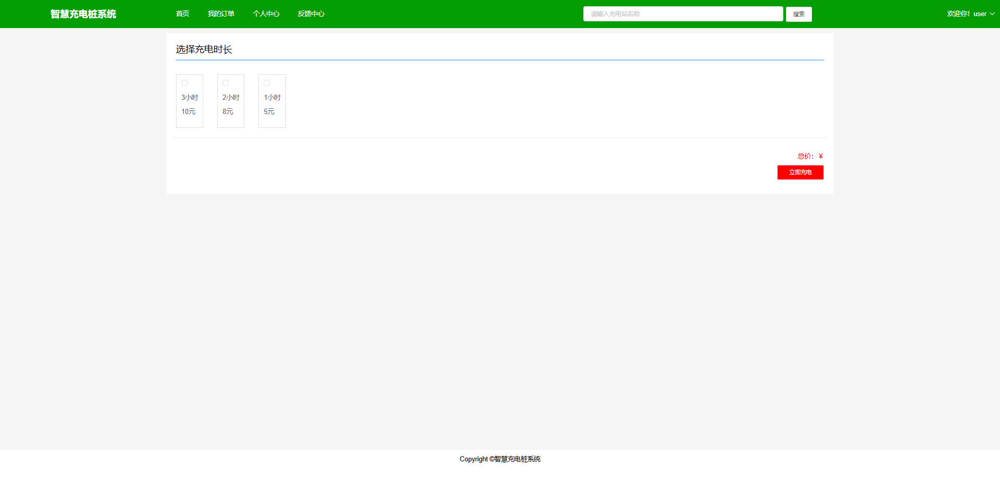

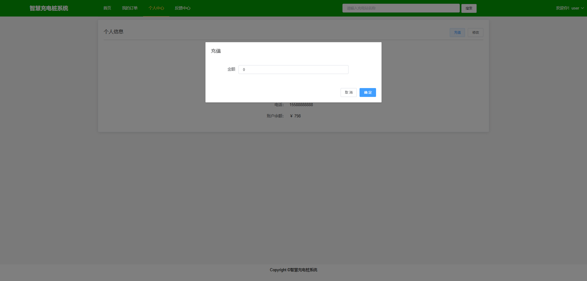

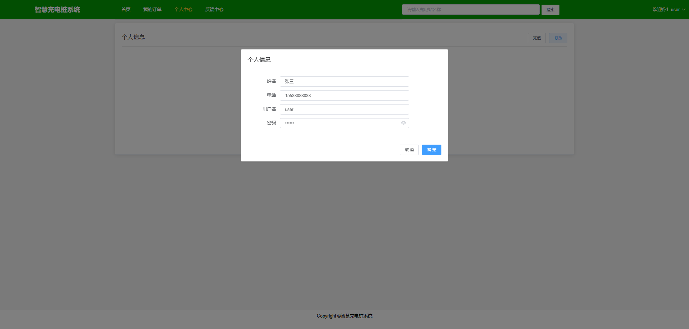

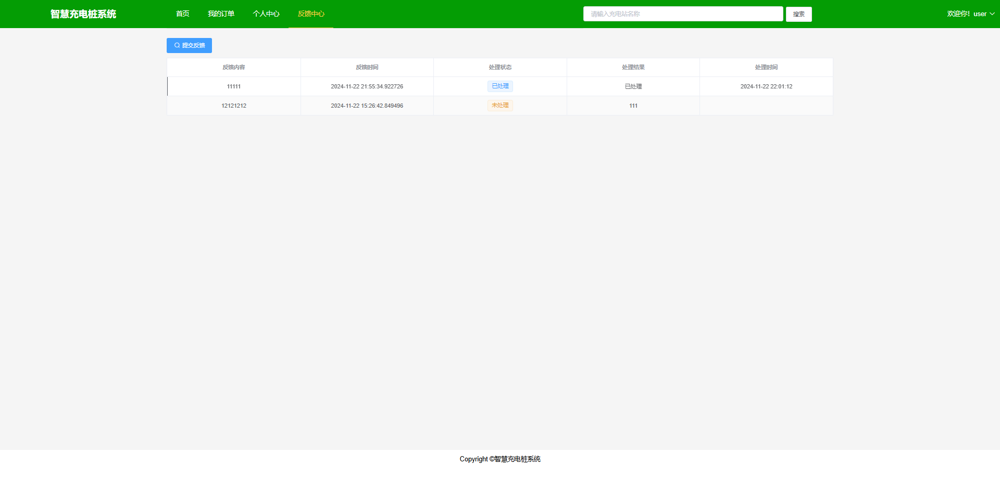

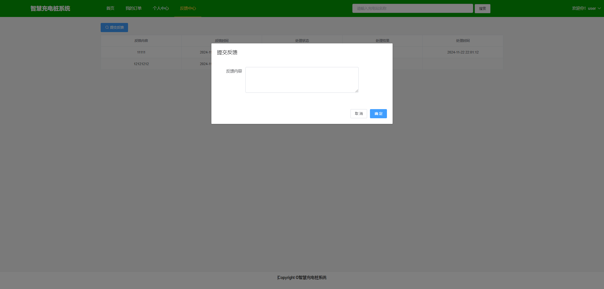

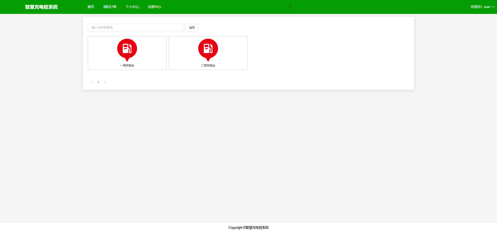
